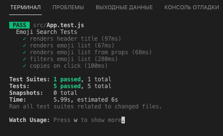

### Gereksinimler

* **[pass]** Başlık kısmının başarılı bir şekilde render edildiğini kontrol edecek olan test kodunu yazın.
* **[pass]** Uygulama ilk açıldığında emoji listesinin başarılı bir şekilde render edildiğini kontrol edecek olan test kodunu yazın.
* **[pass]** Bir filtreleme işlemi yapıldığında, emoji listesinin bu filtreye uygun şekilde yeniden render edildiğini kontrol edecek olan test kodunu yazın.
* **[pass]** Liste üzerinden herhangi emojiye tıklandığında, ilgili emojinin kopyalandığını kontrol edecek olan test kodunu yazın.

***

***

## Selecting Elements

React Testing Library provides different query methods for selecting elements. Each of those query methods belong to one of the following categories:

getBy\*
getByAll\*
queryBy\*
queryAllBy\*
findBy\*
findAllBy\*

There are other methods that can be used to select elements. Following methods belong to the getBy* category of queries.

### getBy\* :

* getByText
* getByRole
* getByLabelText
* getByPlaceholderText
* getByAltText
* getByDisplayValue

### queryBy\* :

* queryByText
* queryByRole
* queryByLabelText
* queryByPlaceholderText
* queryByAltText
* queryByDisplayValue

Surely you see a pattern here. Other categories have similar methods.

## Selecting Elements using the id Attribute
If none of the above mentioned query methods allows you to select any particular element, you could add a data-testid attribute on the element that you want to select and then select that element using **getByTestId** function.

## Assertive Functions

* toBeDisabled
* toBeEnabled
* toBeEmpty
* toBeEmptyDOMElement
* toBeInTheDocument
* toBeInvalid
* toBeRequired
* toBeValid
* toBeVisible
* toContainElement
* toContainHTML
* toHaveAttribute
* toHaveClass
* toHaveFocus
* toHaveFormValues
* toHaveStyle
* toHaveTextContent
* toHaveValue
* toHaveDisplayValue
* toBeChecked
* toBePartiallyChecked
* toHaveDescription

