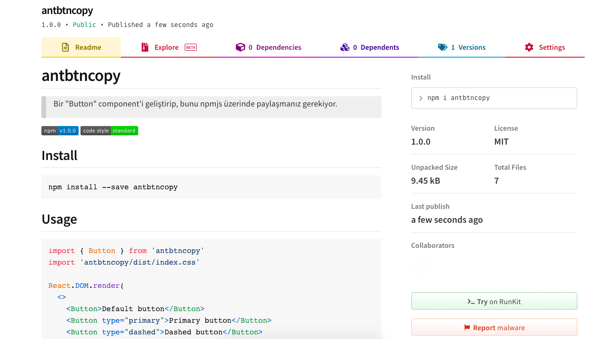

## Odev 5

Bir "Button" component'i geliştirip, bunu npmjs üzerinde paylaşmanız gerekiyor.

Gereksinimler

- Button bileşenine geçilecek olan "type" prop'u ile button'un tipi değişmelidir. (primary, default, dashed, text, link)
- Stillendirmeyi dilediğiniz gibi yapabilirsiniz.
- İlgili component npmjs.com üzerinde paylaşılmalı ve indirilebilir olmalıdır.
- Component'i npmjs üzerine harhangi bir isimle gönderebilirsiniz.

<https://www.npmjs.com/package/antbtncopy>

